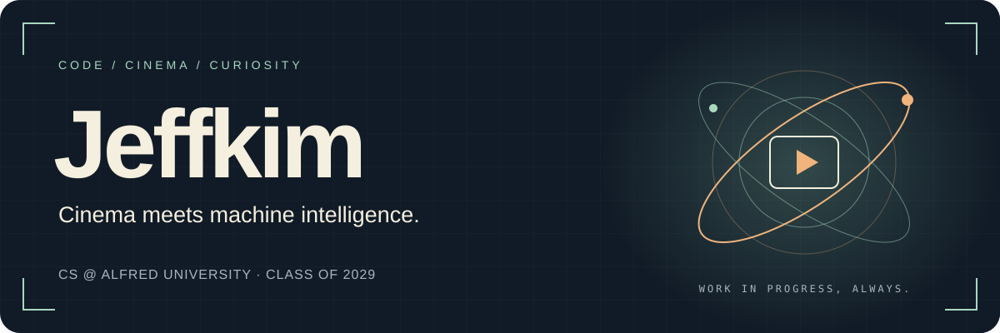
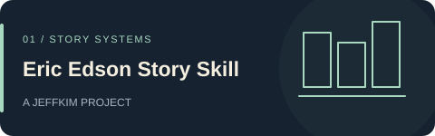
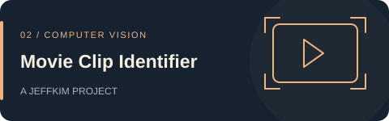
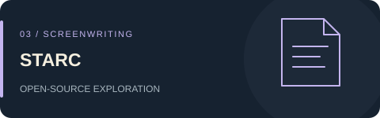
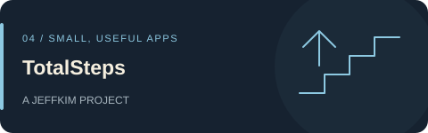
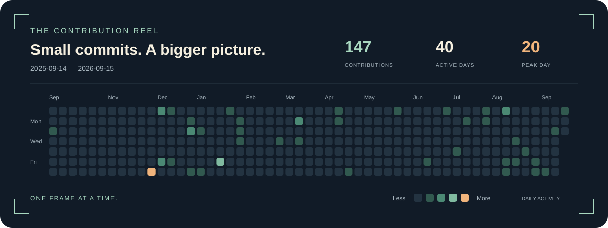

<!-- Welcome behind the scenes. -->

**Building tools for stories, screens, and everyday distractions.**

&nbsp;

 

### ◉ &nbsp; In the current frame

I'm **Jeffkim**, a computer science student at **Alfred University, class of 2029**. I'm exploring the overlap between filmmaking, computer vision, and useful software—from screenplay structure to finding the source of a video clip.

I like clear constraints, thoughtful interfaces, and small ideas that become things you can actually use.

 

### ↗ &nbsp; Selected projects

<table>
<tr>
<td width="50%" valign="top">

Develop and diagnose screenplays through character goals, act structure, and story beats using Eric Edson's method.

<code>Codex skill</code> <code>Markdown</code>

<a href="https://github.com/jeffkimkimo/eric-edson-story-skill">Explore the project ↗</a>
</td>
<td width="50%" valign="top">

Match short clips to source videos in a local catalog. A proof of concept built around visual fingerprints.

<code>Python</code> <code>SQLite</code> <code>FFmpeg</code>

<a href="https://github.com/jeffkimkimo/movie_clip_identifier">Explore the project ↗</a>
</td>
</tr>
<tr>
<td width="50%" valign="top">

Exploring how screenwriting tools are built through my fork of STARC, an open-source screenwriting application.

<code>C++</code> <code>Open-source fork</code>

<a href="https://github.com/jeffkimkimo/starc">Explore the project ↗</a>
</td>
<td width="50%" valign="top">

How many steps have you taken in your lifetime? A minimalist step tracker built around that one question.

<code>Swift</code>

<a href="https://github.com/jeffkimkimo/TotalSteps">Explore the project ↗</a>
</td>
</tr>
</table>

**Elsewhere:** [MyHaven](https://github.com/jeffkimkimo/myhaven), the code behind my [personal portfolio ↗](https://jeffkim.work).

 

### ⌘ &nbsp; The toolkit

 

### ◷ &nbsp; The contribution reel

One frame at a time. A year of building, in color.

  

Daily GitHub contributions · <a href="https://github.com/jeffkimkimo?tab=overview">View full contribution history ↗</a>

 

<b>Behind the scenes · open source &amp; how I build</b>

#### Exploring in open source

These are **forks of existing projects**:

- [starc](https://github.com/jeffkimkimo/starc) — exploring how screenwriting software is built in C++.
- [AI-Storyboard](https://github.com/jeffkimkimo/AI-Storyboard) — agent skills and workflows for storyboards and pre-visualization.

#### From first idea to final cut

**01 · Start with a question.** Give the tool a clear job. 
**02 · Work with constraints.** Keep the scope small enough to finish. 
**03 · Make the interface earn its place.** Help people get to what they came for. 
**04 · Ship, test, revise.** Treat the first version like a first cut.

 

**Into film, AI, or making something useful?** [Let's talk ↗](mailto:jeffkimkimo@gmail.com)

